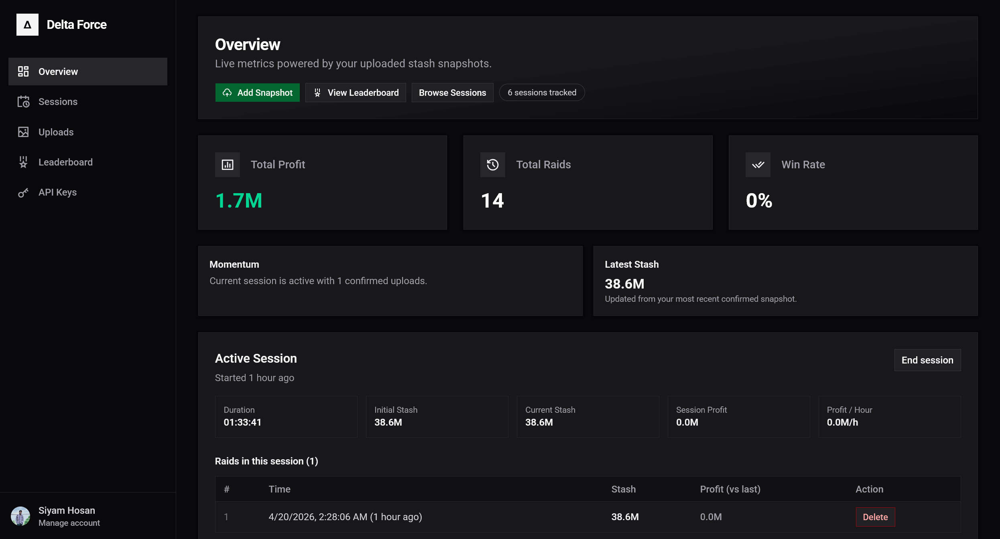
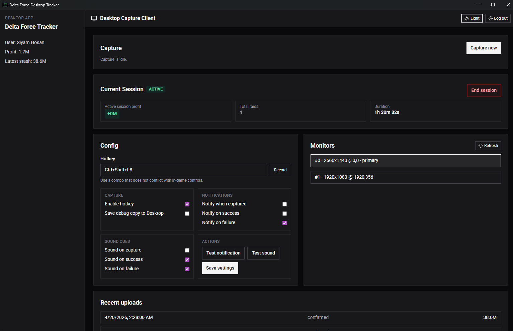
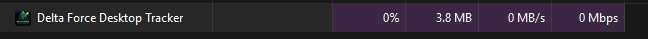

# Delta Force Profit Tracker

**Track your stash value, profit, and performance over time in Delta Force: Hawk Ops.**

No memory reading. No ban risk. Just pure stats powered by screenshots and smart AI.

---

## See it in action

### Web Dashboard


### Desktop Tracker



---

## Why use this?

The in-game profile is great, but it doesn't tell the whole story. If you want to see your **long-term profit trajectory**, detailed **session history**, and compare your economic performance with the community, this tool is for you.

---

## Features

- **Desktop Companion App:** A lightweight, non-invasive Windows app that runs alongside your game.
- **Hotkey Capture:** Hit a hotkey to instantly grab and upload your stash value without alt-tabbing.
- **AI-Powered:** We use OCR (text recognition) to automatically read your stash value from screenshots.
- **Smart Analytics:** Track your profit over different gaming sessions, view your progress on beautiful charts, and see how you stack up on the leaderboards.
- **Secure & Private:** Your data is yours. Authentication is handled securely via Clerk.

---

## Getting Started

1. **Create an account / Login** with Google or Twitch on [https://dfstash.bzr.lt](https://dfstash.bzr.lt)
2. **Upload** your in-game profile screenshots and enjoy tracking!

*(Optional but highly recommended)*
- **Get the Desktop App**
- Link it with the website
- Setup your hotkey
- Press the hotkey to instantly capture and enjoy tracking!

### Downloads

- [Delta Force Desktop Tracker Setup (.exe)](https://github.com/siyamhosan/DeltaForcePorfitTracker/releases/download/v0.1.0/Delta.Force.Desktop.Tracker_0.1.0_x64-setup.exe)
- [Delta Force Desktop Tracker Installer (.msi)](https://github.com/siyamhosan/DeltaForcePorfitTracker/releases/download/v0.1.0/Delta.Force.Desktop.Tracker_0.1.0_x64_en-US.msi)

---

## For Developers

Want to run this yourself or contribute? We'd love your help!

**The Stack:** 
- **Web:** React 19, Vite, Tailwind CSS
- **Desktop:** Tauri (Rust)
- **Backend:** Elysia (Bun), PostgreSQL, Drizzle
- **AI/OCR:** FastAPI, DocTR

### Quick Start

Make sure you have [Bun](https://bun.sh) and Docker installed.

```bash
# Install dependencies
bun install

# Start the web and API dev servers
bun dev

# Start the Desktop App
cd apps/desktop
bun tauri dev
```

To run the full production environment (API, Database, and OCR service), use Docker Compose:

```bash
cp .env.example .env
docker compose up -d --build
```

---

*Delta Force Profit Tracker is free and open source.*
